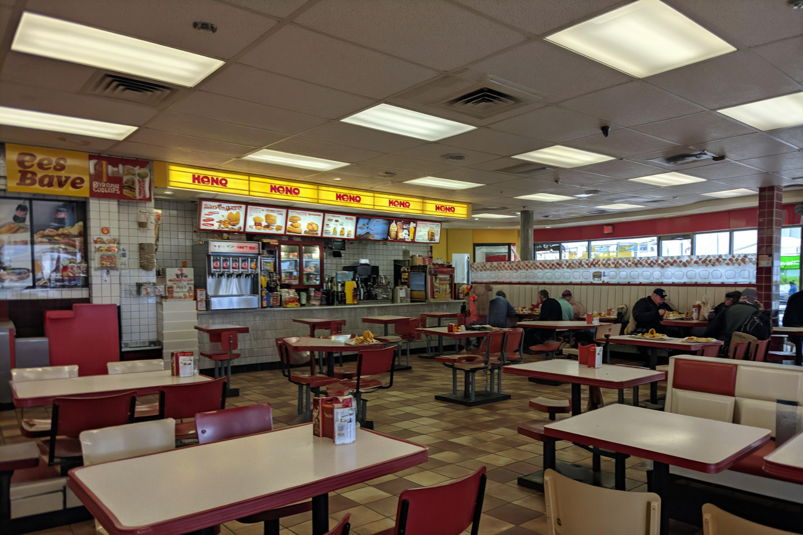

# UltraReal Imagen


This repository contains a Modal deployment for an advanced Text-to-Image inference endpoint using the **Qwen/Qwen-Image** model equipped with the **SamsungCam UltraReal LoRA**. This configuration allows you to generate highly realistic, cinematic, and professional-grade images.

## Features
- **Serverless GPU Deployment**: Scalable deployment on an A100-80GB GPU using [Modal](https://modal.com/).
- **Text-to-Image Generation**: Directly generates images using the powerful Qwen-Image model.
- **UltraReal LoRA**: Baked-in `Danrisi/Qwen-image_SamsungCam_UltraReal` LoRA for realistic, cinematic photography outputs.

## Setup & Deployment

1. Install the Modal client and authenticate:
   ```bash
   pip install modal
   modal setup
   ```

2. Deploy the application:
   ```bash
   # For temporary development server:
   modal serve main.py

   # For production deployment:
   modal deploy main.py
   ```

3. Once deployed, Modal will output a URL for the `/infer` endpoint (e.g., `https://<your-workspace>--ultrareal-imagen-infer.modal.run`).

## Usage

You can interact with the deployed API via a simple POST request containing form data.

### Request Parameters (Form Data)
- `prompt` (string, required): The text description of the image you want to generate.
- `seed` (int, default=42): Random seed for reproducibility.
- `randomize_seed` (boolean, default=true): Whether to randomize the seed on each request.
- `guidance_scale` (float, default=4.0): Controls how closely the model follows the prompt.
- `steps` (int, default=40): Number of inference steps.
- `width` (int, optional): Image width.
- `height` (int, optional): Image height.

*(Note: Adding `, Ultra HD, 4K, cinematic composition.` to your English prompts is recommended for the best results.)*

### cURL Example

```bash
curl -X POST "https://YOUR_WORKSPACE_NAME--ultrareal-imagen-infer.modal.run" \
  -F "prompt=A highly realistic close-up portrait of a beautiful fashion model in a professional photography studio, detailed skin texture, soft dramatic lighting, sharp focus, 85mm lens, Ultra HD, 4K, cinematic composition." \
  -F "width=1056" \
  -F "height=1584" \
  -F "guidance_scale=4.0" \
  --output result.png
```

### Test Client

A sample test client is provided in `test_client.py`. Make sure to replace the `MODAL_ENDPOINT` URL inside the script with your actual deployed URL before running it.

```bash
pip install requests pillow
python test_client.py
```
